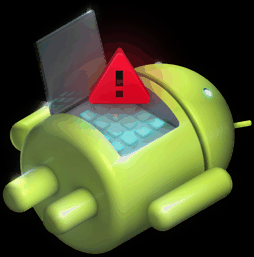

# Android Reversing Workbench



Some tools for manual Android app analysis

### What's in this docker image?

Current:
* apktool
* androguard
* dex2jar
* jd-gui
* jadx
* android-sdk
* mitmproxy

TODO:
* AVD-emulators - SDK is in, just nothing in README yet

### Building

_this will take a long time!_   
`$ ./scripts/build_docker.sh`

### Basic Usage

`$ ./scripts/vanilla_launch.sh`

_which is essentially:_      
`$ docker run -v $PWD/samples:/tmp/samples --rm -it --network none android-reversing-workbench:latest`

For the args above that aren't self-explanatory:

 docker-argument | why
 :--- | :---
 \--rm | remove after run because these are teardowns |
 \-it | interactive + tty |
 \--network none | even though these are arm apps there's an AVD emulator in there, we don't want network requests going unless you say so
\-v | volume mount the local samples dir for use inside the container

### GUI Decompilation

Useful if you want to use use JD-GUI for example.    
Note: If you need this to work on MacOS then you'll need to do some extra work with Xquartz see [here](https://sourabhbajaj.com/blog/2017/02/07/gui-applications-docker-mac/) for details.

`$ ./scripts/gui_launch.sh`

Then you could do something like:
```
$ dex2jar /tmp/samples/yourfoo.apk
$ jd-gui
```
this will launch the GUI decompiler

### mitmproxy
```
$ ./scripts/usb_launch.sh

# adb devices
List of devices attached
* daemon not running. starting it now on port 5037 *
ADB server didn't ACK
* failed to start daemon *
error: cannot connect to daemon
# adb kill-server
* server not running *
root@1e58ff8d2e79:/# adb devices
List of devices attached
* daemon not running. starting it now on port 5037 *
* daemon started successfully *
063fb29ef0eaa207    unauthorized

# adb devices
List of devices attached
063fb29ef0eaa207    device

# adb reverse tcp:9850 tcp:8080
# mitmproxy
```

Then be sure to connect to wifi with the proxy of localhost:8080 on the device ;)
